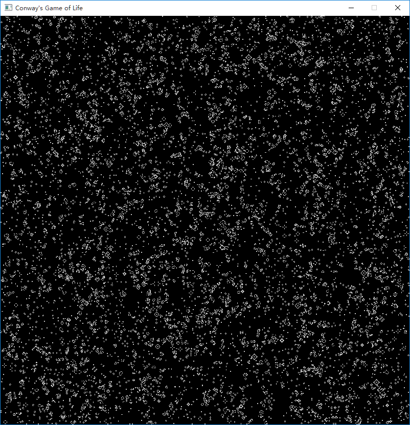
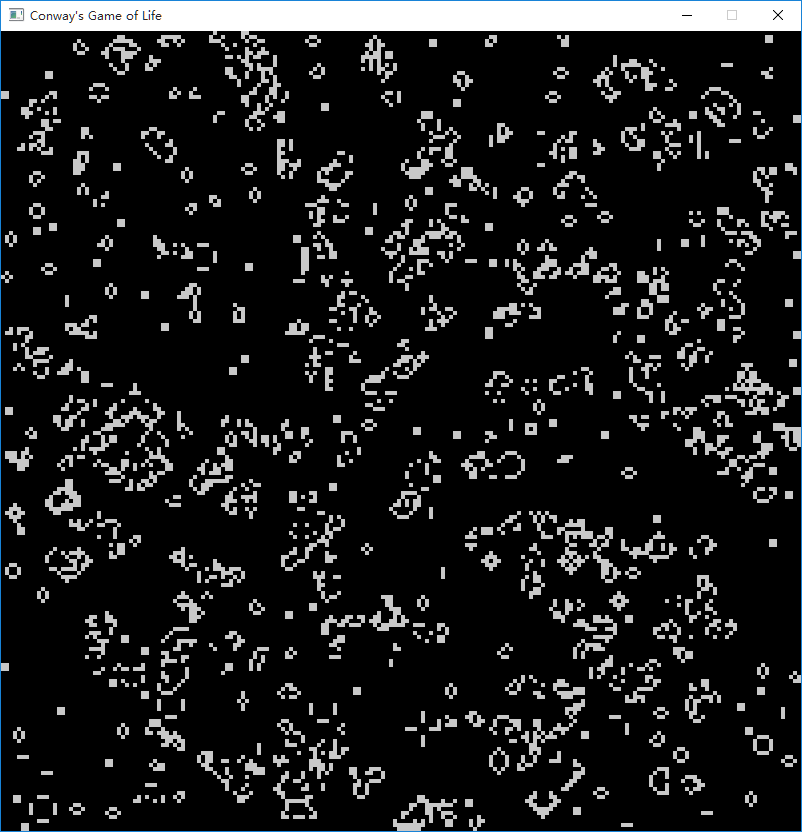

# Conway's Game of Life  
Written in C++ and CUDA C with Visual Studio 2013.  
  
Include:  
- Console version  
- GUI version  
- CUDA acceleration  
  
Control of the GUI version:    
- w: FPS++  
- s: FPS--  
- space: clear screen  
- r: re-generate cells  
- p: pause  
- n: next frame(only on pause)  
- press z and move mouse: make cells live  
- press x and move mouse: make cells die  
- mouse mid-button click: draw a gosper glider gun  
  
  
  

